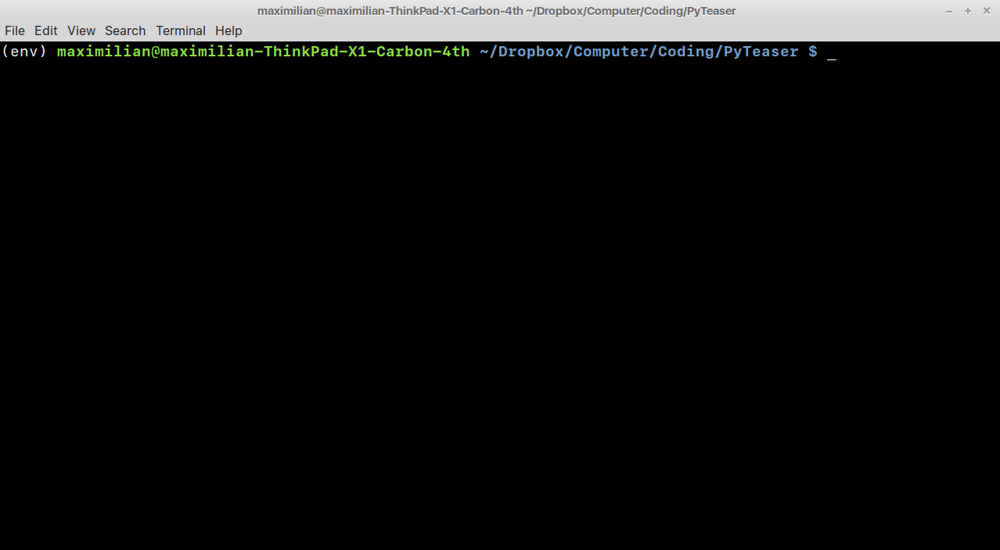

# Goal

Have a Docker Container that exposes the Classify and URL Classify Functions via a RESTAPI


# HowTo
- Have a Python Project
- In this example its [PyTeaser](/home/maximilian/Dropbox/Computer/Coding/PyTeaser)

------------------------------------

### Create a virtualenv

Open a shell console in the root folder of your target project


Find out which python version your project needs and set the Path to the interpreter accordingly.
E.g. for python2.7:
```sh
path_to_interpreter='/usr/bin/python2.7'
```
Create folder 'env' and run
```sh
virtualenv --python=$path_to_interpreter ./env
```

Your VirtualEnvironment is now ready to use in ./env

Set your console to operate inside the environment by typing:
```sh
source ./env/bin/activate
```
##### Your console should now look something like this (mind the "(env)" at the beginning of the testline):


---------------------------

**if** there already is a requirements.txt in your project,
Install the requirements:
```sh
#make sure your console operates inside your env ((env) at the beginning of the line)
./env/bin/pip install -r requirements.txt
```

**else**
install the projects requirements.
Executing your functions and reading the error messages should give you hints, which packages are required. E.g. the errormessage "No module named flask" tells you to install flask package in your environment (see below)
Maybe you'll need to google the errormessage to find the packages names.


e.g.

```sh
#make sure your console operates inside your env ((env) at the beginning of the line)
pip install flask
```

generate your requirements.txt
do this when all necessary libraries have been installed, or everytime you add a new one.
```sh
#make sure your console operates inside your env ((env) at the beginning of the line)
env/bin/pip freeze > requirements.txt
```

---------------------------------------------


create a runServer.py file inside the project


TODO

```python
from flask import Flask, url_for, json, request
app = Flask(__name__)
from pyteaser import Summarize, SummarizeUrl

#setup
host = '0.0.0.0'
port = 5001


@app.route('/summarize', methods = ['POST'])
def summarize():
    args = request.json['args']
    article_title = args[0]
    article_text = args[1]
    request.json['result'] = Summarize(article_title, article_text)
    return ' '.join(request.json['result']).encode('utf_8')

if __name__ == '__main__':
    app.run(host=host, port=port)
```

---------------------------------------------------

# Dockerize


DOCKERFILE:
```ỳaml
# Using official python runtime base image
FROM python:2.7

# Set the application directory
WORKDIR /app

# Install our requirements.txt
ADD requirements.txt /app/requirements.txt
RUN pip install -r requirements.txt

# Copy our code from the current folder to /app inside the container
ADD . /app

# Make port 5001 available for links and/or publish
EXPOSE 5001

# Define our command to be run when launching the container
CMD ["python", "runServer.py"]

```

```sh
sudo docker build . -f ./docker/Dockerfile -t maxfuchs/summarizeteaser
```

```sh
sudo docker run -p 5001:5001 maxfuchs/summarizeteaser:latest
```


--------------------------------------------------
